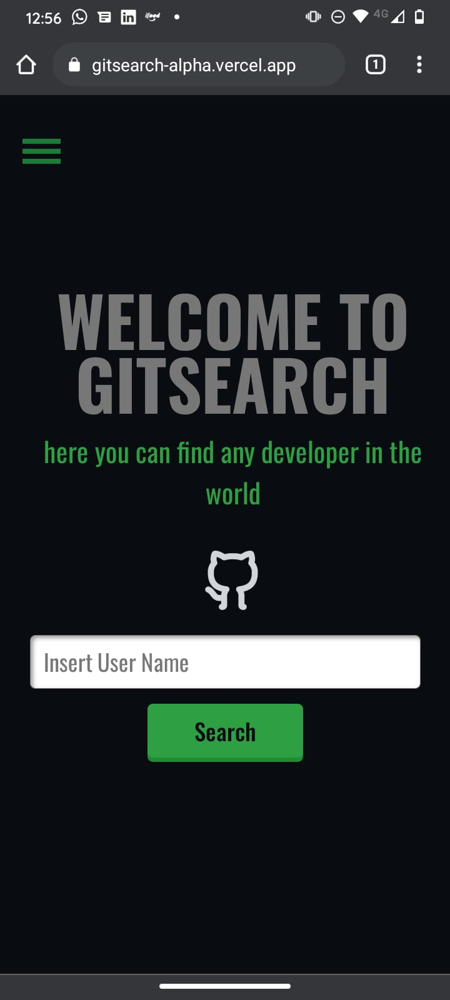
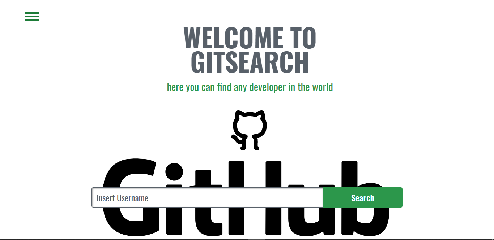
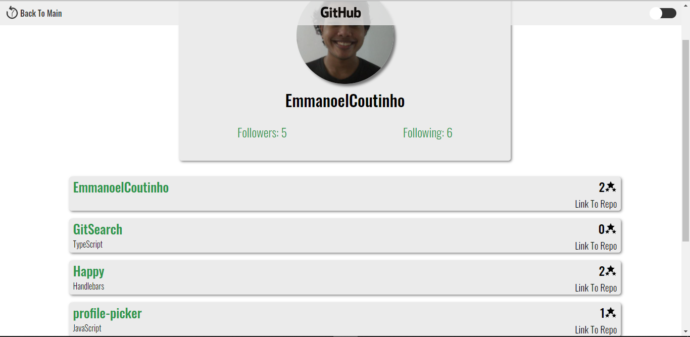

# Here you can find any developer in the world!

This is an web application that lists your repositories on github, made using Typescript, styled-components and React.

<h2><a href="https://gitsearch-alpha.vercel.app/">Link to site</a></h2>

## How to use?

<h3>Frist of all:</h3>

### `Yarn`

to get all the dependencies that were used in this project, you can check them in the package.json,

<h3>Now, the environment variables:</h3>

In this project i used two environment variables, and you have two options about that:

<h3>Frist:</h3>
You can go to the github api documentation and make your own keys, after that create a .env file at the root of the project and write: 
 REACT_APP_GITHUB_PUBLIC= your_public_key; 
 REACT_APP_GITHUB_SECRET= your_secret_key;

<h3>Second:</h3>
You can just delete the environment variables, which are called in the app.tsx, remove them from fetch and useEffect as well and it should work (the first is more advisable! ^^)

<h2>Preview</h2>
<h3>Dark Mode:</h3>
    
    
<h3>Light Mode:</h3>
    
    
